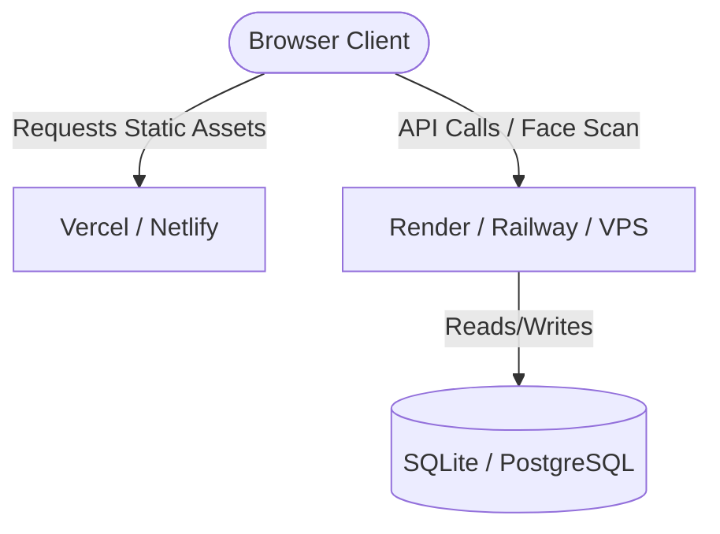

# HackManager Deployment Guide

This document outlines the steps to deploy the **HackManager** application (Vite+React Frontend and Django REST Backend) to production.

---

## 1. Architecture Overview



* **Frontend:** Built with Vite, React, TailwindCSS, and TypeScript. Compiles into static HTML/JS/CSS assets. Can be hosted on static web providers.
* **Backend:** Built with Django and Django REST Framework. Uses MediaPipe and OpenCV (which require system-level C++ graphical libraries). Hosted in a containerized environment (Docker) or a virtual environment on a Linux VPS.
* **Database:** Uses SQLite by default. For production deployment, you can configure PostgreSQL or MySQL.

---

## 2. Frontend Deployment (Vercel or Netlify)

Vite frontends are extremely easy to deploy directly from your GitHub repository.

### Steps:
1. **Host on Vercel / Netlify:**
   - Log into [Vercel](https://vercel.com) or [Netlify](https://netlify.com) using your GitHub account.
   - Click **Add New Project** (Vercel) or **Import from Git** (Netlify).
   - Select the `ShreyDudie/HackManager` repository.
2. **Configure Build Settings:**
   - **Root Directory:** `Frontend`
   - **Build Command:** `npm run build`
   - **Output Directory:** `dist`
3. **Environment Variables:**
   - Add a new environment variable:
     - `VITE_API_URL`: Set this to your live backend URL (e.g., `https://hackmanager-api.onrender.com`).
     - `VITE_GROQ_API_KEY`: Your Groq API key for chatbot features.
4. **Deploy:** Click **Deploy**. Vercel/Netlify will automatically build the site and provide a public URL.

---

## 3. Backend Deployment (Render, Railway, or VPS)

Because the Django backend uses **MediaPipe** and **OpenCV**, standard serverless functions (like Vercel Serverless) will fail due to missing native binary libraries (`libGL.so.1`, `libgthread-2.0.so.0`, etc.). 

The best and most reliable way to deploy the backend is using **Docker**.

### A. Dockerizing the Backend
Create a `Dockerfile` in the `/backend` folder:

```dockerfile
FROM python:3.11-slim

# Install system dependencies required by OpenCV and MediaPipe
RUN apt-get update && apt-get install -y \
    libgl1-mesa-glx \
    libglib2.0-0 \
    libsm6 \
    libxext6 \
    libxrender-dev \
    && rm -rf /var/lib/apt/lists/*

WORKDIR /app

# Copy dependencies and install
COPY requirements.txt .
RUN pip install --no-cache-dir -r requirements.txt

# Copy backend files
COPY . .

# Expose port and run server using gunicorn
EXPOSE 8000
CMD ["python", "manage.py", "runserver", "0.0.0.0:8000"]
```

### B. Hosting on Render or Railway (Container Mode)
1. **Create Web Service:**
   - Go to [Render](https://render.com) or [Railway](https://railway.app).
   - Select **New Web Service** and link your GitHub repo.
2. **Configure Settings:**
   - **Root Directory:** `backend`
   - **Runtime / Environment:** Choose **Docker** (Render/Railway will automatically detect the `Dockerfile` inside the root directory if specified, or you can point it to `backend/Dockerfile`).
3. **Add Environment Variables:**
   - `PYTHONUNBUFFERED`: `1`
   - `SECRET_KEY`: Set a long random string.
   - `DEBUG`: `False` (for production)
4. **Deploy:** Render/Railway will build the Docker container, install the native visual libraries, and launch your API service.

---

## 4. Environment Variables Checklist

### Frontend (.env)
```env
VITE_API_URL=https://your-backend-domain.com
VITE_GROQ_API_KEY=your_groq_api_key
```

### Backend (PaaS/OS Environment)
```env
DEBUG=False
ALLOWED_HOSTS=your-backend-domain.com,your-frontend-domain.com
SECRET_KEY=your_django_secret_key
```
